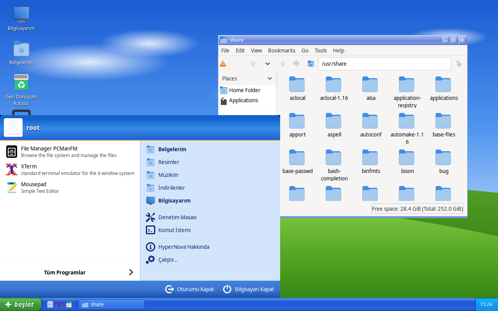
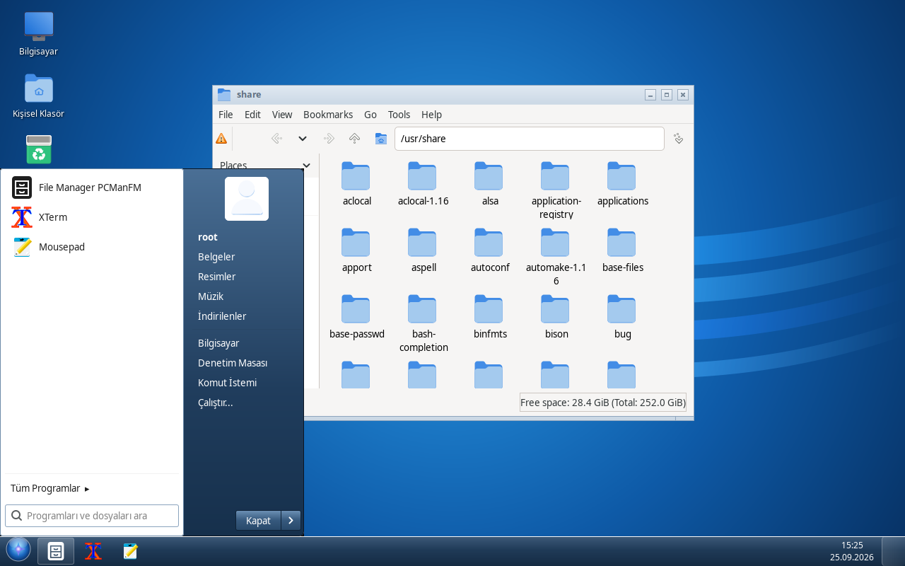
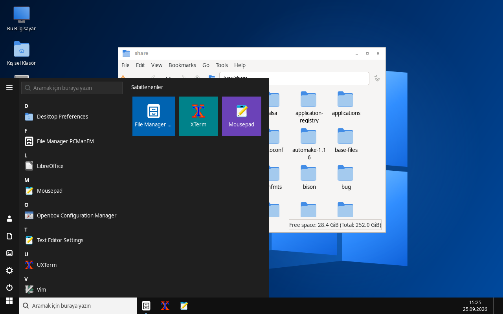
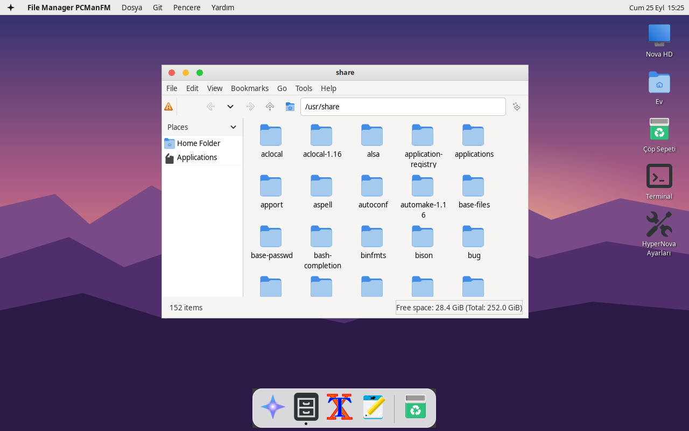
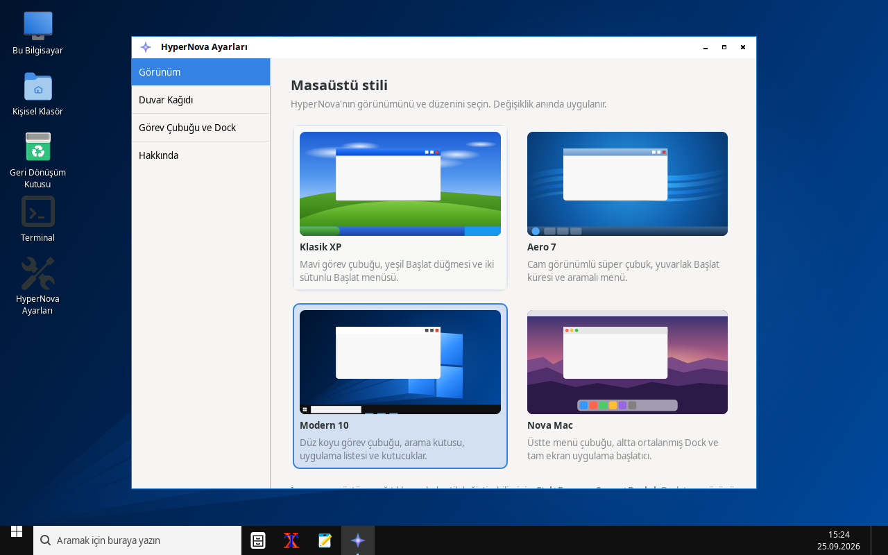

# HyperNova

**HyperNova OS**'un masaüstü ortamı. Arch Linux tabanlıdır ve MIT lisansıyla
tamamen açık kaynaktır. Tek bir ayarla dört farklı görünüme geçebilirsiniz:
**Klasik XP**, **Aero 7**, **Modern 10** ve **Nova Mac**.

HyperNova bir web sayfası değildir: gerçek bir X11 masaüstü oturumudur.
Pencereleri **Openbox** yönetir, masaüstünü, görev çubuğunu/Dock'u ve Başlat
menüsünü **GTK3 + libwnck** ile yazılmış HyperNova kabuğu çizer. Giriş
ekranında (LightDM vb.) "HyperNova" oturumunu seçip kullanabilirsiniz.

| Klasik XP | Aero 7 |
|---|---|
|  |  |
| **Modern 10** | **Nova Mac** |
|  |  |



## Özellikler

- **Dört stil**, her biri kendi düzeni, Başlat menüsü, duvar kağıdı ve pencere
  temasıyla birlikte gelir:
  - **Klasik XP:** mavi görev çubuğu, yeşil "başlat" düğmesi, hızlı başlatma,
    pencere adlı görev düğmeleri, iki sütunlu Başlat menüsü ve açılır
    "Tüm Programlar" menüsü.
  - **Aero 7:** cam görünümlü süper çubuk, parlak Başlat küresi, arama kutulu
    Başlat menüsü, "Masaüstünü göster" köşesi.
  - **Modern 10:** düz koyu görev çubuğu, "Aramak için buraya yazın" kutusu,
    harf başlıklı uygulama listesi ve renkli kutucuklar.
  - **Nova Mac:** üstte menü çubuğu (etkin uygulamanın adı, Dosya, Git,
    Pencere menüleri), altta ortalanmış Dock ve tam ekran Launchpad; pencere
    düğmeleri solda, trafik ışığı renklerinde.
- Stil **anında** değişir: Ayarlar'dan ya da masaüstüne sağ tıklayıp
  "Masaüstü stili" menüsünden seçmeniz yeterli. Openbox pencere teması da
  birlikte değişir.
- Yüklü tüm uygulamalar `.desktop` dosyalarından otomatik bulunur, kategorilere
  ayrılır ve aranabilir. Uygulamalar görev çubuğuna/Dock'a sabitlenebilir.
- Çalışan pencereler görev çubuğunda/Dock'ta gruplanır: tıklayınca öne gelir
  ya da küçülür, sağ tık ile kapat/küçült/ekranı kapla.
- Bildirim alanı: saat ve takvim, ses (PipeWire/PulseAudio), ağ
  (NetworkManager) ve pil göstergesi.
- Masaüstü simgeleri, "Çalıştır" penceresi, stil uyumlu "Bilgisayarı Kapat"
  penceresi (beklemeye al, kapat, yeniden başlat, oturumu kapat).
- **HyperNova Ayarları:** önizlemeli stil seçimi, yerleşik veya kendi duvar
  kağıdınız, saat biçimi, masaüstü simgeleri, sabitlenmiş uygulamalar.
- Arayüz Türkçedir.

## Klavye kısayolları

| Kısayol | İşlev |
|---|---|
| `Ctrl+Esc` veya `Super+Boşluk` | Başlat menüsü / Launchpad (`xcape` kuruluysa yalnızca `Super`) |
| `Super+S` | Menüyü arama kutusu seçili açar |
| `Super+R` / `Alt+F2` | Çalıştır |
| `Super+E` | Kişisel klasör |
| `Super+D` | Masaüstünü göster |
| `Super+I` | HyperNova Ayarları |
| `Ctrl+Alt+T` | Terminal |
| `Ctrl+Alt+Delete` | Bilgisayarı Kapat penceresi |
| `Alt+Tab`, `Alt+F4` | Pencere değiştir, pencereyi kapat |
| `Super+←/→/↑/↓` | Sola/sağa yasla, ekranı kapla, önceki boyut |

## Arch Linux'a kurulum

```sh
git clone https://github.com/exgg3169/Hyper-Nova-Desktop-Environment.git
cd Hyper-Nova-Desktop-Environment/packaging/arch
makepkg -si
```

Paket `openbox`, `gtk3`, `libwnck3`, `python-gobject` ve `python-cairo`
bağımlılıklarını kurar. Önerilen ek paketler: `picom` (Aero/Mac saydamlığı),
`xcape` (tek başına Super tuşu), `pcmanfm`, `lxterminal`, `mousepad`,
`networkmanager`, `wireplumber`, `lightdm-gtk-greeter`.

Kurulumdan sonra giriş ekranında **HyperNova** oturumunu seçin ya da
`~/.xinitrc` dosyasına `exec hypernova-session` yazıp `startx` çalıştırın.

Paket kullanmadan: `sudo make install` (kaldırmak için `sudo make uninstall`).

## HyperNova OS ISO kalıbı

`iso/` klasörü, Arch'ın resmî `releng` archiso profilini temel alıp
HyperNova'yı ve küçük bir varsayılan araç setini ekleyen canlı ISO yapılandırmasıdır.
Canlı sistem `nova` kullanıcısıyla otomatik olarak HyperNova oturumunu açar;
dil Türkçe, klavye TR-Q'dur.

```sh
sudo pacman -S --needed archiso
sudo ./iso/build-iso.sh        # ISO dosyası ./out/ klasörüne yazılır
```

GitHub'da **Actions → HyperNova OS ISO → Run workflow** ile de derlenebilir;
`v*` etiketlerinde ISO otomatik olarak sürüme eklenir.

## Android başlatıcısı (APK)

`android/` klasörü, telefonlar için **HyperNova Launcher** uygulamasıdır. Aynı
dört stili (XP görev çubuğu ve Başlat menüsü, Aero 7 küresi, Modern 10 arama
kutusu ve kutucuklar, Nova Mac Dock'u ve Launchpad) Android ana ekranı olarak
sunar. Uzun basınca sabitleme, uygulama bilgisi ve kaldırma seçenekleri çıkar.
Ekrandaki boş alana uzun basmak veya saate dokunmak ayarları açar.

- **APK'yı indirme:** GitHub'da **Actions → Android APK** çalıştırmasının
  "Artifacts" bölümünden `hypernova-launcher-apk` dosyası indirilir. `v*`
  etiketiyle bir sürüm yayımlandığında APK, **Releases** sayfasına da eklenir.
- **Kurulum:** APK'yı telefona indirip açın ("bilinmeyen kaynaklar" izni
  gerekir). Ardından *Ayarlar → Varsayılan ana ekran yap* düğmesiyle
  HyperNova'yı ana ekran olarak seçin.
- **Kendiniz derlemek için:** Android SDK kurulu bir makinede
  `cd android && gradle assembleRelease`.

> **Önemli:** APK, HyperNova'nın görünümünü ve kullanımını Android'e getiren
> bir *başlatıcıdır*. Arch Linux tabanlı HyperNova OS'u telefonda çalıştırmaz;
> bir Android uygulaması başka bir işletim sistemini açamaz. Gerçek HyperNova
> masaüstünü telefonda çalıştırmak (Termux + proot içinde Arch ve VNC/X11
> bağlantısı) yol haritasındadır.

## Geliştirme

Kaynak klasörden, çalışan bir X oturumu içinde:

```sh
make run            # kabuğu başlatır (bir pencere yöneticisi, tercihen Openbox, çalışıyor olmalı)
make run-settings   # HyperNova Ayarları
make check          # derleme + Xvfb üzerinde tüm stillerle duman testi
```

Ayarlar `~/.config/hypernova/settings.json` dosyasında tutulur; kabuk bu
dosyayı izler ve değişiklikleri anında uygular. Openbox yapılandırması etkin
stile göre `~/.config/hypernova/openbox/rc.xml` olarak üretilir.

### Proje yapısı

```
hypernova/          Python paketi (kabuk ve ayarlar uygulaması)
  shell.py          oturumdaki tüm yüzeyleri yöneten ana süreç
  taskbar.py        XP / 7 / 10 görev çubuğu
  mac.py            menü çubuğu ve Dock
  startmenu.py      dört Başlat menüsü ve Launchpad
  tasks.py          açık pencere takibi (libwnck)
  tray.py           saat, ses, ağ, pil
  desktop.py        duvar kağıdı ve masaüstü simgeleri
  wallpapers.py     cairo ile çizilen duvar kağıtları
  openbox.py        stile uygun Openbox rc.xml üretimi
  settings_app.py   HyperNova Ayarları
data/styles/        her stilin GTK CSS dosyası
data/themes/        Openbox pencere temaları (XP, 7, 10, Mac)
bin/                hypernova-shell, hypernova-settings, hypernova-session
packaging/arch/     PKGBUILD
iso/                HyperNova OS canlı ISO profili
android/            HyperNova Launcher (Android, Java, bağımlılıksız)
tests/smoke.sh      başsız duman testi
```

## Lisans

[MIT](LICENSE). Windows ve macOS, sahiplerinin ticari markalarıdır; HyperNova
bu sistemlerden hiçbir dosya, simge veya görsel içermez, stiller yalnızca
genel düzenlerden esinlenir ve tüm görseller bu projede sıfırdan çizilmiştir.
